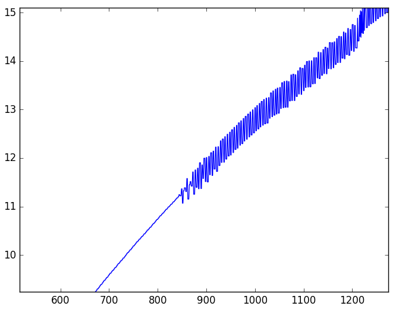

# PID Control
---

## Reflection

The PID gains were tuned manually. Search methods like Twiddle and even a variant of gradient descent was attempted but wasn't extremely useful because it was not possible to start or stop the simulator through a script. Therefore manual method was resorted to. The following process was used to tune the controller.

1. `Kd` and `Ki` were set to zero and only `Kp` was set to a small value. This value was steadily increased till oscillations set in.
2. `Kd` was slowly increased till the oscillations reduced or died down.
3. At this point, `Kp` was increased again to a value large enough to provide sufficient correction at sharp turns. `Kd` was tuned simultaneously to adjust the oscillations.
4. Steady state error was estimated by plotting the `cte`. `Ki` was adjusted till `cte` appeared equally distributed on both sides of `0`. Often, `Ki`introduced oscillations. So `Kd` was tuned simultaneously to keep them under check.

The final values that worked for a speed of 25 mph are as follows:
```
double stKp = 0.20;
double stKi = 0.0001;
double stKd = 5.5;
``` 

A PI control for throttle was also implemented and the values are as follows:
```
double thKp = 0.25;
double thKi = 0.002;
double thKd = 0;

```

### Jitter in the input

It was noticed that the inputs from the simulator had a jitter - even without the PID control in action. We could not find the source of this jitter. This jitter certainly impacted the derivative term because it no longer represents the true physical rate of change of error. A small filter was added to mitigate this jitter. A filter, of course, introduces phase lags and therefore increases oscillations. Therefore it was not possible remove this effect completely.

Following plot shows the jitter in speed inputs from the simulator that "switches on" after ~850 frames



### Possible improvements
1. **Gain scheduling:** While these PID gains work well at 25 mph, they will not generalize to higher (over even lower) speeds. It is possible to vary these with speed or "schedule" different gains at different speed ranges.
2. **Filtered derivative:** The derivative term in real systems is often noisy, especially when it is digitally computed by differences. Sensor values therefore, need to be filtered well (perhaps digitally) before derivatives error terms are computed. 

## Dependencies

* cmake >= 3.5
 * All OSes: [click here for installation instructions](https://cmake.org/install/)
* make >= 4.1(mac, linux), 3.81(Windows)
  * Linux: make is installed by default on most Linux distros
  * Mac: [install Xcode command line tools to get make](https://developer.apple.com/xcode/features/)
  * Windows: [Click here for installation instructions](http://gnuwin32.sourceforge.net/packages/make.htm)
* gcc/g++ >= 5.4
  * Linux: gcc / g++ is installed by default on most Linux distros
  * Mac: same deal as make - [install Xcode command line tools]((https://developer.apple.com/xcode/features/)
  * Windows: recommend using [MinGW](http://www.mingw.org/)
* [uWebSockets](https://github.com/uWebSockets/uWebSockets)
  * Run either `./install-mac.sh` or `./install-ubuntu.sh`.
  * If you install from source, checkout to commit `e94b6e1`, i.e.
    ```
    git clone https://github.com/uWebSockets/uWebSockets 
    cd uWebSockets
    git checkout e94b6e1
    ```
    Some function signatures have changed in v0.14.x. See [this PR](https://github.com/udacity/CarND-MPC-Project/pull/3) for more details.
* Simulator. You can download these from the [project intro page](https://github.com/udacity/self-driving-car-sim/releases) in the classroom.

There's an experimental patch for windows in this [PR](https://github.com/udacity/CarND-PID-Control-Project/pull/3)

## Basic Build Instructions

1. Clone this repo.
2. Make a build directory: `mkdir build && cd build`
3. Compile: `cmake .. && make`
4. Run it: `./pid`. 

Tips for setting up your environment can be found [here](https://classroom.udacity.com/nanodegrees/nd013/parts/40f38239-66b6-46ec-ae68-03afd8a601c8/modules/0949fca6-b379-42af-a919-ee50aa304e6a/lessons/f758c44c-5e40-4e01-93b5-1a82aa4e044f/concepts/23d376c7-0195-4276-bdf0-e02f1f3c665d)


